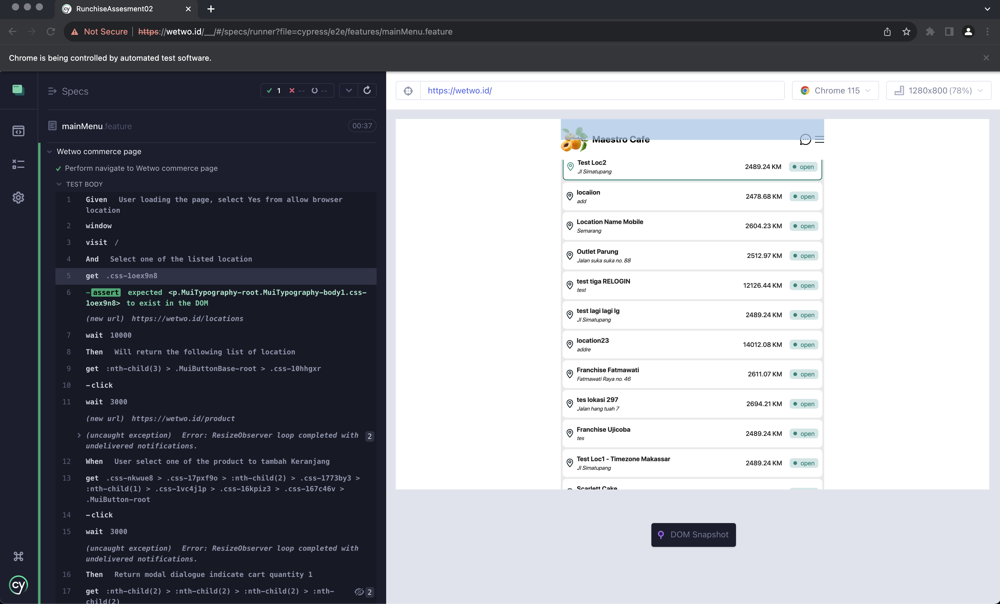

# BDD + Cypress Web Automation

Previously already completed the assessment as in the following link :

[Q1 : git@gist.github.com:217dbaa5f5fbe21e18959603f057daf8.git](https://gist.github.com/purrarri/217dbaa5f5fbe21e18959603f057daf8)

Navigate to

Q2 The scenario test:
        1. Open website https://wetwo.id/
        2. When loading the page, you will be asked to allow browser location permission, choose Yes
        3. Then you will see a list of location, choose of the location
        4. After that you will be redirect to list of products, choose one of the product, click the plus sign to add to cart
        5. Add that product twice to the cart, you will see a floating button with the total amount of 2 selected products, click that floating button to go to cart page
        6. Make sure the selected products are shown correctly in the cart page
        7. In the cart page, remove just 1 qty from the selected product and click the product name or product image to show up the product detail popup.

Automation written in Javascript leveraging Cypress, Gherkin, allure as reporting and POM (Page Object Model).

## Test Environments

- [Dashboard](https://wetwo.id/)

## Prerequisites

- Node.js is installed on your local machine
- ** In order to successfully run all the scenarios, make sure to create a json file called "cypress.env.json"**. Here's how the file content should look like:

To adjust browser location permission by default, I added these folllowing config :

```
  npm i cypress cypress-browser-permissions --save-dev
```
And set the following behaviour by default to allow :

```
env: {
      browserPermissions: {
        notifications: "allow",
        geolocation: "allow",
      }
}

```

To ensure a well-organized structure, I have split the project into three main folders.

Feature: In this folder, I outline the test scenarios and steps in Gherkin/Cucumber format. It describes the application's behavior in a structured way, making it easier to understand and maintain test cases. Feature file represents a specific feature of the application under test and contains scenarios and corresponding steps.

Pages: This folder houses the Page Object Model (POM) files. Each page object represents a page or a component of the application. Within these files, I declare the getters and setters for the elements present on those pages. This approach enhances the maintainability of the tests, as any changes to the application's UI can be localized within the corresponding page object, making the test suite more dynamic and adaptable.

Step Definitions: The step_definitions folder contains the implementation of each step defined in the feature files. Here, I write the actual code that interacts with the application to execute the tests. These step definitions act as a bridge between the Gherkin scenarios and the Cypress test scripts. By separating the step definitions from the feature files, I ensure a clean and modularized code structure, making it easier to manage and update test cases.

Overall, this project structure and organization help maintain clarity, reusability, and scalability of the test suite. The BDD approach using Gherkin/Cucumber enhances collaboration between team members and stakeholders by providing a common language to describe the application's behavior. The POM pattern for the pages ensures that any UI changes can be accommodated efficiently, and the step definitions separate the test logic from the scenario descriptions, promoting maintainability and readability of the test code.


## How to Run Test With Cypress GUI

1. Clone this project
2. Open your IDE and terminal
3. CD to the project directory
4. run the following command to install cypress and the dependencies

```
npm install
```

5. Run npm run test or if that does not work try npx cypress open

```
npx cypress open
```

6. Wait for the Cypress GUI to appear
7. Click the feature scenarios 
8. Once the test is done running, close the tab and Cypress GUIs

GUI report




As in the following another report by screenshot and video, also stored in allure-result


## Findings

1. 
# RunchiseAssesment02
